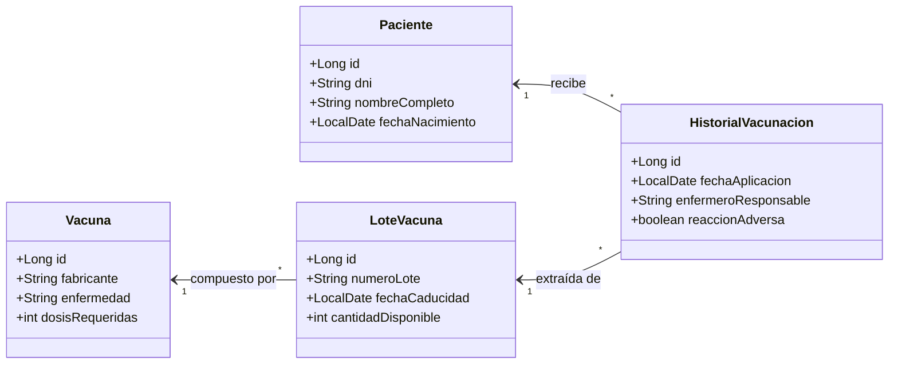

# 💉 Blueprint: Clínica "Vacunas Salud"

## 📝 1. Enunciado y Contexto
La clínica médica **Vacunas Salud** necesita gestionar la base de datos de los pacientes que asisten a inocularse diferentes tipos de vacunas. Hasta ahora llevaban el registro en Excel, pero necesitan migrar a un sistema relacional donde queden registradas las dosis aplicadas, los lotes de las vacunas y el historial de cada paciente. 

El modelo requerirá registrar pacientes, el catálogo de vacunas disponibles, los lotes físicos en stock y las citas de vacunación registradas.

## 🎯 2. Objetivos de Aprendizaje
* Practicar el mapeo de **entidades M:N (Many-to-Many) con atributos extra**, lo que requiere transformarlo en dos relaciones `1:N`.
* Modularización del proyecto usando una estructura estándar de persistencia (`Entity / Dao`).
* Manejo de fechas (`LocalDate`, `LocalDateTime`) en Hibernate.
* Integración fluida en GitHub con `gh cli`.

## 🛠️ 3. Stack Tecnológico
* **Lenguaje:** Java 21+
* **Gestor de Dependencias:** Maven
* **Framework ORM:** Hibernate Core 6.x / JPA
* **Base de Datos:** PostgreSQL 16+
* **Control de Versiones:** Git + GitHub CLI (`gh`)
* **IDE Recomendado:** IntelliJ IDEA

## 🏗️ 4. UML y Arquitectura de Datos (Mermaid)
Este es el diseño arquitectónico a implementar. Observa que `CitaVacunacion` actúa como entidad intermedia entre `Paciente` y `LoteVacuna`.

## 🚀 5. Blueprint: Guía de Implementación Paso a Paso

**Fase 1: Configurar Proyecto en IntelliJ y GitHub**
1. Abrir la carpeta del proyecto en IntelliJ IDEA y hacer click secundario sobre ella para "Añadir Framework Support -> Maven" (o crear el `pom.xml` manualmente).
2. Añadir dependencias `<dependency>` de `hibernate-core` y `postgresql`.
3. Compilar el proyecto con Maven (`mvn clean install`).
4. Lanzar por terminal: `gh repo create clinica-vacunas --public --source=. --remote=origin --push`.

**Fase 2: Mapeo de Entidades con JPA (Anotaciones)**
1. Crear el paquete `com.vacunassalud.domain`. Configurar clases Java para el modelo.
2. Anotar la clase `Paciente`: usar `@Column(unique=true)` para el DNI.
3. Anotar `Vacuna` y `LoteVacuna`: Un `OneToMany` desde `Vacuna` hacia `LoteVacuna`.
4. El corazón es `HistorialVacunacion`:
   * `@ManyToOne` hacia `Paciente`.
   * `@ManyToOne` hacia `LoteVacuna`.
   * Esta es tu tabla de resolución Many-to-Many con los campos `fechaAplicacion` y `enfermeroResponsable`.
5. Usar `@CreationTimestamp` si deseas llenar automáticamente la fecha insertada.

**Fase 3: Pruebas CRUD**
1. Crear el `hibernate.cfg.xml`. Validar que levanta el `SessionFactory` y crea las 4 tablas mágicamente en Postgres (`hbm2ddl.auto = update`).
2. Insertar una vacuna base (Ej: Covid-19, Pfizer).
3. Insertar un lote que caduca en diciembre del año actual con 50 dosis disponibles.
4. Insertar a "Juan Navarro" como `Paciente`.
5. Guardar un `HistorialVacunacion` que conecte a Juan Navarro con el Lote registrado.
6. Guardar cambios en el repositorio con `git commit` y Subir código con `git push`.
