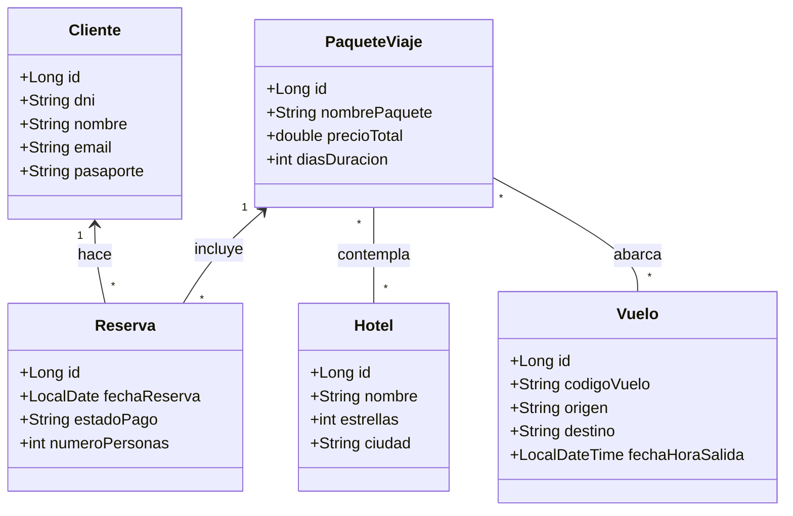

# ✈️ Blueprint: Sistema de Gestión "Agencia de Viajes"

## 📝 1. Enunciado y Contexto
La **Agencia de Viajes "Mundo Explora"** está abandonando su viejo sistema de reservas en archivos locales. Necesita una aplicación robusta que maneje paquetes turísticos complejos. 
El sistema gestionará destinos turísticos, los diferentes hoteles asociados, los vuelos disponibles y los paquetes que los viajeros pueden contratar. Finalmente, la agencia debe poder emitir reservas de paquetes a sus clientes registrados.

## 🎯 2. Objetivos de Aprendizaje
* Dominar anotaciones Hibernate como `@Entity`, `@Table`, `@Column`.
* Modelar relaciones clásicas **Many-to-Many M:N** directas (usando `@ManyToMany` y `@JoinTable`).
* Gestionar el estado de objetos transitorios usando Cascadas (`CascadeType`).
* Desarrollar familiaridad con repositorios remotos Git y comandos `gh`.

## 🛠️ 3. Stack Tecnológico
* **Lenguaje:** Java 21+
* **Gestor de Dependencias:** Maven
* **Framework ORM:** Hibernate Core 6.x / JPA
* **Base de Datos:** PostgreSQL 16+
* **Herramientas de CLI:** `git` y `gh`
* **IDE Recomendado:** IntelliJ IDEA

## 🏗️ 4. UML y Arquitectura de Datos (Mermaid)
Este es un proyecto altamente conectado. Un paquete puede incluir **varios** hoteles y **varios** vuelos (y viceversa).



## 🚀 5. Blueprint: Guía de Implementación Paso a Paso

**Fase 1: Configurar Proyecto en IntelliJ y GitHub**
1. Mover la carpeta del proyecto a formato standard `src/main/java`.
2. Crear un `pom.xml` con dependencias Maven de PostgreSQL y Hibernate 6.x.
3. Ejecutar comandos iniciales:
   ```bash
   echo "target/" >> .gitignore
   git init
   git add .
   git commit -m "Inicializamos proyecto de AgenciaViajes"
   gh repo create agencia-viajes-app --public --source=. --remote=origin --push
   ```

**Fase 2: Entity Mapping & M:N (Hibernate)**
1. En `PaqueteViaje`, definir relaciones de muchos a muchos con `Hotel` y `Vuelo`:
   * `@ManyToMany`
   * Usar `@JoinTable(name="paquete_hotel", joinColumns=..., inverseJoinColumns=...)`
   * Usar `@JoinTable(name="paquete_vuelo")` para los vuelos.
2. En `Hotel` y `Vuelo`, mapear inversamente con `mappedBy`.
3. Anotar `Cliente` y su relación directa `OneToMany` con `Reserva` (Un cliente puede reservar múltiples veces).
4. `Reserva` tendrá un `ManyToOne` apuntando al `Cliente` y otro `ManyToOne` apuntando a `PaqueteViaje`.

**Fase 3: Hibernate Session & Pruebas**
1. Proveer archivo `hibernate.cfg.xml`.
2. Usar IntelliJ para escribir un `main` de prueba:
   * **Crear Catálogos:** Insertar al Hotel "Marriot 5*" y dos vuelos ("MAD-NY", "NY-MAD").
   * **Crear el Paquete:** Instanciar un `PaqueteViaje`, asociar el Hotel y los 2 Vuelos. Guardarlo (`session.persist()`).
   * **Realizar Venta:** Instanciar un `Cliente` (guardarlo), instanciar una `Reserva` asociada al cliente y a ese Paquete.
3. Hacer nuevo *Commit* indicando el avance del backend.
