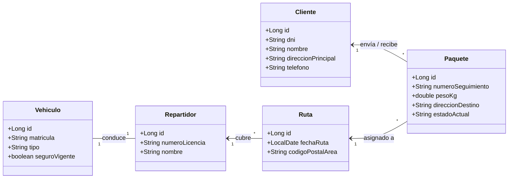

# 📦 Blueprint: Logística y Paquetería "Mensajería Express"

## 📝 1. Enunciado y Contexto
La empresa de paquetería **Mensajería Express** gestiona miles de envíos diarios y necesita migrar su estructura de datos desde aplicaciones no relacionales hacia un potente ORM empresarial sobre PostgreSQL.
La plataforma necesita manejar **Clientes** (remitentes y destinatarios), los **Paquetes** a entregar, los **Repartidores** en plantilla, la flota de **Vehículos**, y finalmente asignar rutas diarias que cubren varios paquetes.

## 🎯 2. Objetivos de Aprendizaje
* Modelar relaciones 1:1 (Usando `@OneToOne` para relacionar `Vehiculo` y `Repartidor` - asumiendo uso fijo asignado).
* Manejar Fetch Types (Eager vs Lazy) para mejorar rendimiento en jerarquías profundas (`Cliente -> Paquete -> Ruta -> Repartidor`).
* Ejercicios clásicos de migración CLI GitHub (`gh repo create`).
* Manejo de identificadores de seguimiento (`UUID` ó Autogenerados secuencias).

## 🛠️ 3. Stack Tecnológico
* **Lenguaje:** Java 21+
* **Gestor de Dependencias:** Maven
* **Framework ORM:** Hibernate Core 6.x / JPA
* **Base de Datos:** PostgreSQL 16+
* **Herramientas de CLI:** `git` y `gh`
* **IDE Recomendado:** IntelliJ IDEA

## 🏗️ 4. UML y Arquitectura de Datos (Mermaid)
En este escenario modelamos una relación exclusiva 1:1 (Vehículo-Repartidor) sumada a rutas estáticas.



## 🚀 5. Blueprint: Guía de Implementación Paso a Paso

**Fase 1: Preparación Maven y `gh cli`**
1. Generar la estructura de carpetas `src/main/resources`. Añadir tu nuevo `pom.xml`.
2. Lanzar desde consola de PowerShell integrada en IntelliJ:
   ```bash
   gh repo create mensajeria-express --public --source=. --remote=origin --push
   ```
3. Abrir pom.xml, descargar las dependencias `hibernate-core` y `postgresql`.

**Fase 2: Mapeo de Entidades (`@OneToOne`, `@ManyToOne`)**
1. Mapear `Vehiculo` y `Repartidor`.
   * En `Vehiculo`: `@OneToOne(mappedBy="vehiculoAsignado")`.
   * En `Repartidor`: `@OneToOne` más un `@JoinColumn(name="vehiculo_id", unique=true)`.
2. Mapear la jerarquía de `Paquete`.
   * `Paquete`: Con un `@ManyToOne` hacia `Cliente` (remitente) y otro `@ManyToOne` opcional hacia `Ruta`.
   * El número de seguimiento puede generarse usando `@Column(unique=true)`.
3. Mapear `Ruta`: `@ManyToOne` hacia el `Repartidor`.
4. El `Cliente` tendrá un simple `@OneToMany(mappedBy="cliente")` hacia `Paquete`.

**Fase 3: Pruebas CRUD Reales**
1. Configurar hibernate.cfg.xml para conexión con la base de datos `mensajeria`.
2. Crear clase Main:
   * **1. Comprar Furgoneta:** Instanciar Vehiculo y guardarlo.
   * **2. Contratar Chofer:** Instanciar Repartidor, asignarle el Vehiculo antes creado y guardarlo.
   * **3. Nuevo Envío:** Instanciar Cliente. Instanciar 2 Paquetes hacia el mismo cliente.
   * **4. Asignar Ruta:** Crear una Ruta para hoy (LocalDate.now()), asignársela al Repartidor, y enlazar los 2 Paquetes a esa Ruta y actualizar (`merge()`).
3. Commit del código:
   ```bash
   git add .
   git commit -m "Arquitectura ORM finalizada. Todo conectado."
   git push origin main
   ```
