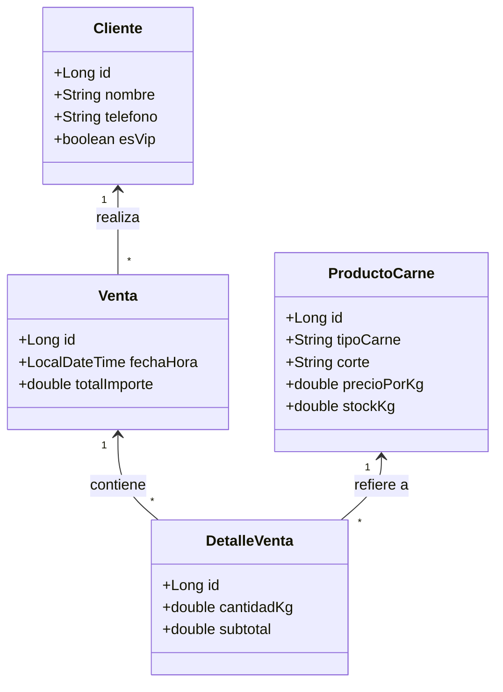

# 🥩 Blueprint: Carnicería "Manolo"

## 📝 1. Enunciado y Contexto
La **Carnicería Manolo** lleva años registrando las ventas de carne (ternera, cerdo, pollo, etc.) en libretas. El dueño quiere digitalizarse y crear una aplicación donde pueda gestionar sus clientes habituales, el stock de los distintos tipos de carne, y generar tickets de venta (pedidos) que reúnan varios productos de forma automática.

## 🎯 2. Objetivos de Aprendizaje
* Modelar relaciones de tipo maestro-detalle (`Venta` y `LineaDeVenta` / `DetalleVenta`).
* Usar `@ElementCollection` o clases entidad para el detalle de la compra.
* Realizar actualizaciones de stock (Update) usando métodos transaccionales en Hibernate.

## 🛠️ 3. Stack Tecnológico
* **Lenguaje:** Java 21+
* **Gestor de Dependencias:** Maven
* **Framework ORM:** Hibernate Core 6.x / JPA
* **Base de Datos:** PostgreSQL 16+
* **Control de Versiones:** Git + GitHub CLI (`gh`)
* **IDE Recomendado:** IntelliJ IDEA

## 🏗️ 4. UML y Arquitectura de Datos (Mermaid)

## 🚀 5. Blueprint: Guía de Implementación Paso a Paso

**Fase 1: Configurar Proyecto en IntelliJ y GitHub**
1. Crear repositorio local (`git init`).
2. Configurar el `pom.xml` con Hibernate y Postgres.
3. Subir esqueleto a GitHub mediante la terminal: `gh repo create carniceria-manolo --public --source=. --remote=origin --push`

**Fase 2: Mapeo de Entidades**
1. `Cliente`: Anotar como `@Entity`.
2. `ProductoCarne`: Anotar como `@Entity`.
3. `Venta`: Relación `@ManyToOne` hacia `Cliente`. Relación `@OneToMany(mappedBy="venta", cascade=CascadeType.ALL)` hacia `DetalleVenta`.
4. `DetalleVenta`: `@ManyToOne` hacia `Venta` y `@ManyToOne` hacia `ProductoCarne`.

**Fase 3: Transacciones y Lógica**
1. Insertar productos básicos: Solomillo de Ternera, Pechuga de Pollo.
2. Insertar un Cliente.
3. Crear una `Venta`, añadirle 2 `DetalleVenta` (1kg de Pollo, 0.5kg de Ternera).
4. Guardar la venta con `session.persist()`. Gracias al cascade, se guardarán los detalles automáticamente.
5. Hacer `git add .` y `git commit -m "CRUD Completo de ventas"`.
