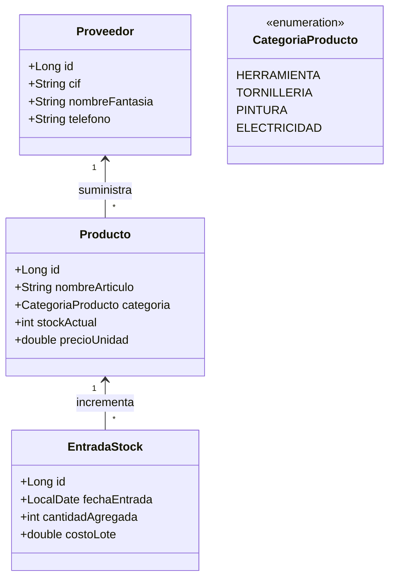

# 🛠️ Blueprint: Sistema de Gestión "Ferretería El Clavo"

## 📝 1. Enunciado y Contexto
La **Ferretería El Clavo** tiene un sistema desfasado de control de inventario y está migrando a un software Java moderno conectado a PostgreSQL. El nuevo sistema necesita gestionar **Productos** (tornillos, martillos, pintura), los **Proveedores** que suministran la mercancía, y el registro de **Entradas de Stock** y **Ventas** de mostrador a clientes de paso o recurrentes.

## 🎯 2. Objetivos de Aprendizaje
* Modelar relaciones polimórficas y enumerados (usar `@Enumerated(EnumType.STRING)` para categorías de producto).
* Entender la persistencia bidireccional entre Proveedor y Producto (Un producto lo trae un proveedor, un proveedor trae varios de ellos).
* Operaciones de actualización (Update) con el método `merge()` para controlar altas y bajas de cantidad.

## 🛠️ 3. Stack Tecnológico
* **Lenguaje:** Java 21+
* **Gestor de Dependencias:** Maven
* **Framework ORM:** Hibernate Core 6.x / JPA
* **Base de Datos:** PostgreSQL 16+
* **Control de Versiones:** Git + GitHub CLI (`gh`)
* **IDE Recomendado:** IntelliJ IDEA

## 🏗️ 4. UML y Arquitectura de Datos (Mermaid)

## 🚀 5. Blueprint: Guía de Implementación Paso a Paso

**Fase 1: Repositorio e Inicialización**
1. Mover carpetas de código y crear estructura de Maven (`.idea` local y `.gitignore`).
2. Configurar dependencias necesarias en `pom.xml`.
3. Lanzar comando para creación de repo alojado: `gh repo create ferreteria-el-clavo --public --source=. --remote=origin --push`.

**Fase 2: Entity Mapping Enum + ManyToOne**
1. Crear el `enum CategoriaProducto`.
2. Crear `Proveedor` y `Producto` con una relación `@ManyToOne` hacia su Proveedor. 
3. Asegurar que `categoria` tiene `@Enumerated(EnumType.STRING)` para que no se guarde como un número sino el nombre textual en tabla.
4. Crear la entidad `EntradaStock` y enlazarla al `Producto` mediante `@ManyToOne`.

**Fase 3: Ejecución de Caso Práctico**
1. Crear el objeto Administrador del Gestor Sesion Hibernate.
2. Insertar un nuevo Proveedor ("Bosch España").
3. Vincular y crear 2 Productos bajo ese proveedor (Ej: Taladro con Categoría "HERRAMIENTA" y 0 stock).
4. Registrar una `EntradaStock` de 50 taladros nuevos, actualizar el inventario del producto modificado y sincronizar en db (`merge()`).
5. Realizar commit: `git commit -m "Registro de productos y proveedores terminado"`.
