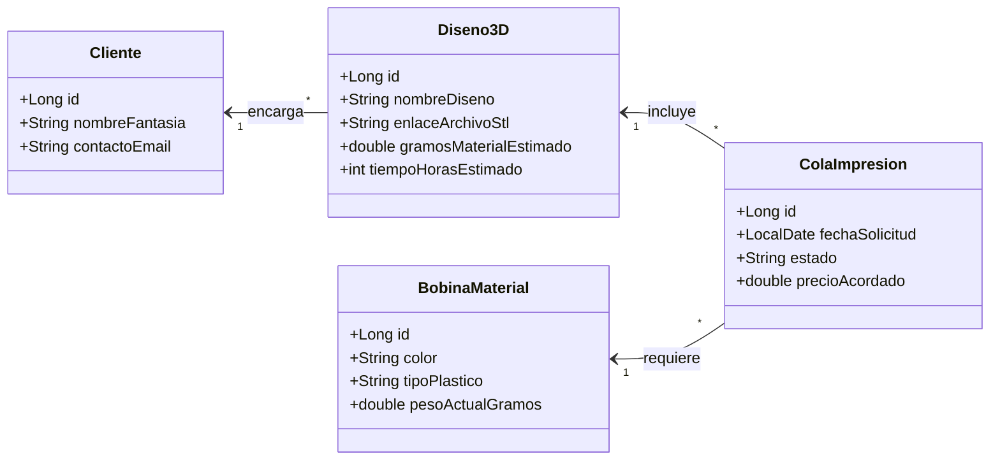

# 🖨️ Blueprint: Gestión "Taller Impresora 3D"

## 📝 1. Enunciado y Contexto
Un **taller de impresión 3D a medida** ha crecido tanto que necesita una base de datos real para gestionar los pedidos de diseño, organizar sus bobinas de filamento (material) y asignar las impresiones en cola a sus máquinas disponibles, guardándolo de manera persistida.

## 🎯 2. Objetivos de Aprendizaje
* Mapeo de Entidades dependientes con atributos específicos.
* Generar repositorios remotos sobre código heredado de Java y adaptarlos al CLI `gh`.
* Gestión de Estados de Entidad (Transient a Persistent).
* Gestión de Inventario simple (restar metros de bobina cada vez que se encola un trabajo).

## 🛠️ 3. Stack Tecnológico
* **Lenguaje:** Java 21+
* **Gestor de Dependencias:** Maven
* **Framework ORM:** Hibernate Core 6.x / JPA
* **Base de Datos:** PostgreSQL 16+
* **Control de Versiones:** Git + GitHub CLI (`gh`)
* **IDE Recomendado:** IntelliJ IDEA

## 🏗️ 4. UML y Arquitectura de Datos (Mermaid)

## 🚀 5. Blueprint: Guía de Implementación Paso a Paso

**Fase 1: Configurar Repositorio**
1. Generar la estructura de carpetas `src/main/resources`. Añadir el `pom.xml`.
2. Lanzar desde consola: `gh repo create taller-impresion3d --public --source=. --remote=origin --push`.
3. Abrir `pom.xml`, añadir `hibernate-core` y `postgresql`.

**Fase 2: Mapeado de Entidades (`ManyToOne`)**
1. Crear entidades independientes: `Cliente` y `BobinaMaterial`.
2. Crear clase `Diseno3D` anotada con `@ManyToOne` refiriendo al `Cliente`.
3. Crear clase `ColaImpresion` (la asignación real de máquina) apuntando al `Diseno3D` elegido, y también a la `BobinaMaterial` que requiere (`@ManyToOne` en ambas).

**Fase 3: Ejecución de Caso Práctico**
1. Insertar Bobina "Negro Matte PLA", con 1000 gramos.
2. Registrar un Cliente.
3. Registrar un Diseño (por ejemplo: Carcasa Raspberry, 50g, Cliente registrado).
4. Guardar los objetos con `session.persist()`.
5. Insertar una tarea en `ColaImpresion` conectando la Carcasa y la Bobina de Negro. Restar "50g" a la Bobina y actualizar con `merge()`. Hacer Commit local de las operaciones.
