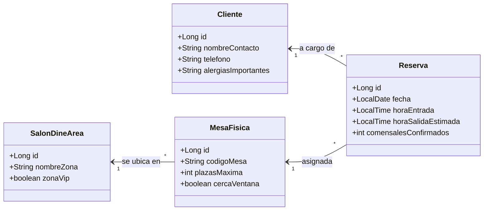

# 🥂 Blueprint: Gestión "Bar Reservas"

## 📝 1. Enunciado y Contexto
Un **Bar y Restaurante con alta demanda** ha crecido descontroladamente gestionando sus mesas con WhatsApp y agendas de papel. El objetivo es estructurar las reservas en un sistema central donde se almacenen el salón del bar, la capacidad de las mesas físicas y el histórico de clientes que ocupan turnos por día (asegurando el horario y la mesa libres de forma automatizada).

## 🎯 2. Objetivos de Aprendizaje
* Enfoque en modelar objetos físicos estáticos del mundo real como entidades (Mesa).
* Gestionar Restricciones Temporales (Reservas sin fechas solapadas para una mesa específica).
* Familiarizarse en aplicar restricciones de clave única para columnas dobles (`@UniqueConstraint(columnNames={"fecha_id", "mesa_id"})`).

## 🛠️ 3. Stack Tecnológico
* **Lenguaje:** Java 21+
* **Gestor de Dependencias:** Maven
* **Framework ORM:** Hibernate Core 6.x / JPA
* **Base de Datos:** PostgreSQL 16+
* **Control de Versiones:** Git + GitHub CLI (`gh`)
* **IDE Recomendado:** IntelliJ IDEA

## 🏗️ 4. UML y Arquitectura de Datos (Mermaid)



## 🚀 5. Blueprint: Guía de Implementación Paso a Paso

**Fase 1: Configurar Proyecto en IntelliJ y GitHub**
1. Generar la estructura de carpetas `src/main/resources`. Añadir el `pom.xml`.
2. Lanzar desde consola de PowerShell integrada en IntelliJ:
   ```bash
   gh repo create bar-reservas --public --source=. --remote=origin --push
   ```
3. Abrir pom.xml, descargar las dependencias `hibernate-core` y `postgresql`.

**Fase 2: Mapeado de Entidades (`@ManyToOne`)**
1. Mapear `SalonDineArea` (Ej: Terraza Exterior o Salón Principal VIP).
2. Crear `MesaFisica`, con `@ManyToOne` refiriendo al `SalonDineArea`.
3. Crear `Cliente` anotado con `@Entity`.
4. El centro estructurado será la clase `Reserva`, anotada con `@ManyToOne` apuntando al `Cliente` responsable, y `@ManyToOne` refiriéndose a la `MesaFisica` asignada en una fecha puntual.

**Fase 3: Pruebas Iniciales CRUD**
1. Levantar Sesión `hibernate.cfg.xml`.
2. Crear "Salón Principal" y una "Mesa 4" con 6 asientos máximos. Guardarlos.
3. Crear al `Cliente`, conectando a la `Reserva` por hoy a las 21:00 hs, y asociando `Mesa 4` para 4 personas. (Validar antes manualmente que no excede plazas). Omitir por ahora el control de reservas simultaneas. Hacer Persist del cliente y la reserva.
4. Git Push - "Arquitectura base completa".
