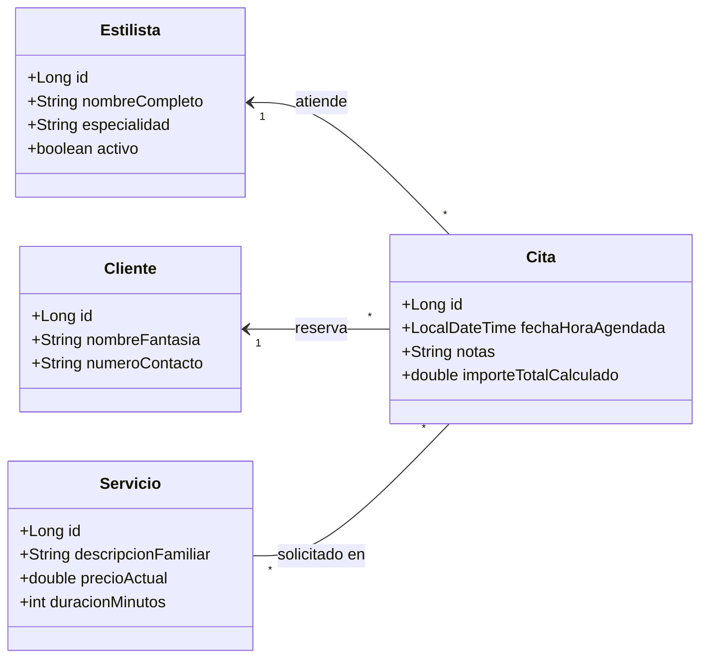

# 💇‍♂️ Blueprint: Sistema "Peluquería Style"

## 📝 1. Enunciado y Contexto
La **Peluquería Style** tiene varios estilistas en plantilla, un catálogo de servicios que cambia constantemente de precio (Corte, Tinte, Lavado, Mechas) y un sistema obsoleto de citas basado en agenda telefónica. La necesidad del proyecto es mapear todo el personal empleado, y crear una agenda de citas vinculada al catálogo de tarifas por servicios dados en una fecha específica.

## 🎯 2. Objetivos de Aprendizaje
* Encontrar el vínculo `Many-to-Many` en entidades referenciales, a diferencia del clásico carrito de producto físico, para servicios.
* Mapeo de Entidades Intermedias (`CitaServicio`) si se opta a cobrar en una misma cita varios tintes o diferentes complementos simultáneamente.
* Consultas simples Hibernate/JPA: HQL/JPQL al seleccionar Servicios.

## 🛠️ 3. Stack Tecnológico
* **Lenguaje:** Java 21+
* **Gestor de Dependencias:** Maven
* **Framework ORM:** Hibernate Core 6.x / JPA
* **Base de Datos:** PostgreSQL 16+
* **Control de Versiones:** Git + GitHub CLI (`gh`)
* **IDE Recomendado:** IntelliJ IDEA

## 🏗️ 4. UML y Arquitectura de Datos (Mermaid)

## 🚀 5. Blueprint: Guía de Implementación Paso a Paso

**Fase 1: Preparación del Repositorio (`gh cli`)**
1. Lanzar `git init` en el directorio, `git add .` seguido de `git commit -m "Carga inicial proyecto Peluquería"`.
2. Lanzar de inmediato por consola: `gh repo create peluqueria-style --public --source=. --remote=origin --push`.
3. Crear el `pom.xml`, definiendo las dependencias requeridas (Hibernate y driver PostgreSQL).

**Fase 2: Relaciones JPA (`M:N` vs `OneToMany`)**
1. Crear entidades unitarias `Estilista`, `Servicio`, `Cliente`.
2. Crear clase `Cita` anotada con `LocalDateTime`. Definir `@ManyToOne` refiriendo al `Estilista` responsable y al `Cliente` de la factura.
3. El corazón: Anexar la relación M:N directa en `Cita` usando una lista o Set. `@ManyToMany` definiendo la etiqueta `@JoinTable(name="citas_servicios", joinColumns=@JoinColumn(name="cita_id"), inverseJoinColumns=@JoinColumn(name="servicio_id"))`.

**Fase 3: Hibernate Session CRUD Transaccional**
1. Levantar conexión: Crear tabla de servicios iniciales si no existen.
   * `Servicio` "Corte de Pelo", 15 USD.
   * `Servicio` "Tinte Balayage", 80 USD.
   * Guardar servicios (`persist`).
2. Levantar "Raúl" como estilista. "Lucía" como clienta particular. Guardar entidades.
3. Agendar turno (hoy a las 11:30): Mapear una nueva Cita relacionada con el Estilista y la Cliente y anexar la lista de Servicios a su colección.
4. Generar log transaccional finalizando el save y el autocomit (`update()` o `persist()`). Git Push - "Agenda Peluquería terminada".
