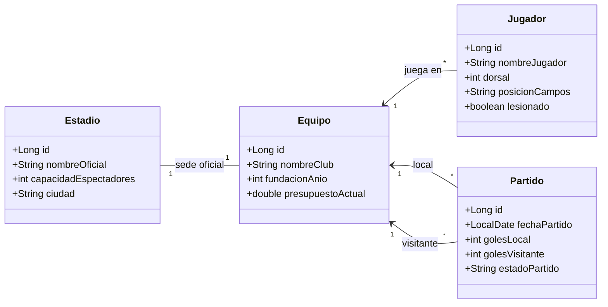

# ⚽ Blueprint: Ligas Deportivas "Fútbol Primera"

## 📝 1. Enunciado y Contexto
El simulador de ligas **Fútbol Primera** ya cuenta con mucha lógica deportiva en memoria (ya tiene `pom.xml`), pero toda la puntuación, las jornadas y los equipos desaparecen al cerrar el programa. El objetivo es conectarlo a PostgreSQL para persistir el mercado de **Equipos**, **Jugadores profesionales**, los **Estadios** donde se juega y finalmente un registro histórico de los **Partidos Jugados** y resultados entre los grandes clubes de primera división.

## 🎯 2. Objetivos de Aprendizaje
* Modelado 1:1 estricto con `@OneToOne(cascade = CascadeType.ALL)` para que un equipo nazca obligatoriamente con un estadio.
* Usar `@ManyToOne` doble dentro de una misma Entidad (Partido: Equipo Local y Visitante).
* Aprovechar un proyecto que ya cuenta con Maven (pom.xml) y modificar únicamente dependencias y ciclo de persistencia.

## 🛠️ 3. Stack Tecnológico
* **Lenguaje:** Java 21+
* **Gestor de Dependencias:** Maven
* **Framework ORM:** Hibernate Core 6.x / JPA
* **Base de Datos:** PostgreSQL 16+
* **Control de Versiones:** Git + GitHub CLI (`gh`)
* **IDE Recomendado:** IntelliJ IDEA

## 🏗️ 4. UML y Arquitectura de Datos (Mermaid)

## 🚀 5. Blueprint: Guía de Implementación Paso a Paso

**Fase 1: Preparación del Repositorio ya existente (`gh cli`)**
1. Lanzar por la PowerShell de IntelliJ (ya que este proyecto probablemente tiene `.git` pero falta el remoto): `gh repo create futbol-primera-orm --public --source=. --remote=origin --push`.
2. Editar el archivo `pom.xml`, definiendo la configuración del bloque `hibernate-core` y `postgresql`.

**Fase 2: Relaciones JPA Complejas (`M:N` vs `OneToMany`)**
1. Crear entidades unitarias `Estadio`, `Jugador`.
2. Crear clase `Equipo` anotada con relaciones complejas. Definir `@OneToOne(cascade = CascadeType.ALL)` refiriendo al `Estadio` de localía. Y un `@OneToMany` albergando la lista de su plantilla (`Jugador`).
3. El corazón: Anexar las relaciones deportivas en `Partido` mapeadas hacia local y visitante:
   * `@ManyToOne` en la propiedad `equipoLocal`.
   * `@ManyToOne` en la propiedad `equipoVisitante`.

**Fase 3: Hibernate Session CRUD Transaccional**
1. Levantar conexión: Crear Estadios ("Santiago Bernabeu", 82000 pax).
2. Crear Equipos ("Real Madrid FC", instanciando y vinculando objeto Estadio previo). Persistir equipo maestro (Y estadio insertado por casacada).
3. Añadir plantilla (Jugador -> "Vinícius Jr"). Actualizar con `merge()`.
4. Modelar Partido J1 "Real Madrid" vs "FC Barcelona" (`Partido` configurado, estado="Finalizado", 2-1). Guardar.
5. `git add .` y subir todo a main "Modelo final primera division completo".
