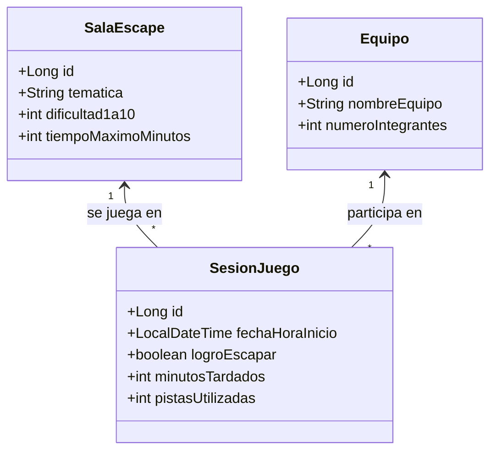

# 🧩 Blueprint: Sistema "Escape Room Virtual"

## 📝 1. Enunciado y Contexto
El **Scaperoom "El Enigma"** cuenta con diferentes salas temáticas (Terror, Misterio, Sci-Fi) y requiere digitalizar las sesiones de juego. Necesitan registrar a los equipos de jugadores, los récords de tiempo para salir de cada sala, y llevar un registro de las pistas consumidas en cada intento.

## 🎯 2. Objetivos de Aprendizaje
* Dominar relaciones bidireccionales y métodos utilitarios (`addJugador()`, `removeJugador()`).
* Tipos de Fetching: Cargar las pistas (Lazy) solo cuando el equipo falla la sala.
* Uso de campos `Duration` o `LocalTime` para cálculos de puntuaciones de tiempo de escape.

## 🛠️ 3. Stack Tecnológico
* **Lenguaje:** Java 21+
* **Gestor de Dependencias:** Maven
* **Framework ORM:** Hibernate Core 6.x / JPA
* **Base de Datos:** PostgreSQL 16+
* **Control de Versiones:** Git + GitHub CLI (`gh`)

## 🏗️ 4. UML y Arquitectura de Datos (Mermaid)

## 🚀 5. Blueprint: Guía de Implementación Paso a Paso

**Fase 1: Preparación del Repositorio**
1. Generar la estructura Maven `pom.xml`.
2. Lanzar: `gh repo create scaperoom-backend --public --source=. --remote=origin --push`.

**Fase 2: Relaciones JPA (`M:N` con Clase Intermedia)**
1. Mapear `SalaEscape` y `Equipo` (`@Entity`).
2. Mapear `SesionJuego` como la tabla intermedia que guarda el histórico de partidas. Asignar `@ManyToOne` hacia Sala y hacia Equipo.

**Fase 3: Hibernate Session CRUD Transaccional**
1. Insertar las salas estáticas: "Laboratorio Zombie" (Dificultad 8, 60min).
2. Insertar al equipo "Los Linces".
3. Simular una partida donde "Los Linces" juegan el "Laboratorio Zombie", no logran escapar (logroEscapar=false), consumen 3 pistas y agotan los 60 minutos.
4. Git Push - "MVP Escape Room".
