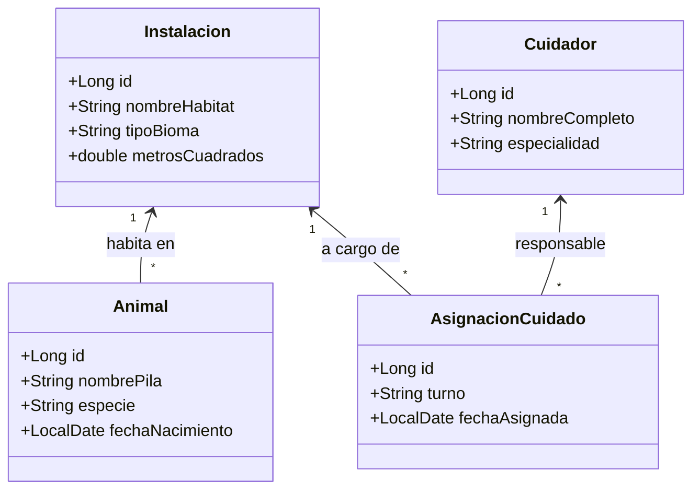

# 🦁 Blueprint: Sistema Gestión "Zoo Park"

## 📝 1. Enunciado y Contexto
El **Zoo Park** necesita modernizar su antiguo sistema Java. El parque tiene varias **Instalaciones** o hábitats (Zona Safari, Reptilario), alberga **Animales** de diversas especies, y contrata **Cuidadores** que tienen asignadas ciertas zonas específicas para alimentar y limpiar.

## 🎯 2. Objetivos de Aprendizaje
* Modelado `@ManyToOne` doblemente enlazado.
* Diferenciar una relación `1:N` pura (Instalación -> Animal).
* Manejar herencias JPA (`@Inheritance(strategy=InheritanceType.JOINED)`) para Tipos de Animal si quisiéramos ser puristas (Mamífero, Reptil), o usar `@Enumerated`.

## 🛠️ 3. Stack Tecnológico
* **Lenguaje:** Java 21+
* **Gestor de Dependencias:** Maven
* **Framework ORM:** Hibernate Core 6.x / JPA
* **Base de Datos:** PostgreSQL 16+
* **Control de Versiones:** Git + GitHub CLI (`gh`)

## 🏗️ 4. UML y Arquitectura de Datos (Mermaid)

## 🚀 5. Blueprint: Guía de Implementación Paso a Paso

**Fase 1: Preparación del Repositorio**
1. Lanzar `gh repo create zoo-park-backend --public --source=. --remote=origin --push`.
2. Añadir `hibernate-core` y `postgresql` en `pom.xml`.

**Fase 2: Relaciones JPA Complejas**
1. Mapear `Instalacion` `(1:N)` a `Animal`. Un Animal solo tiene un hábitat al mismo tiempo.
2. Definir a los Cuidadores con su clase y mapear la tabla intermedia `AsignacionCuidado`. Este cuidador toma el turno "Mañana" en la instalación "Reptilario".

**Fase 3: CRUD Transaccional**
1. Insertar Instalación ("Sabana Africana", "Bioma Seco").
2. Insertar Animal ("Simba", "León", que vive en "Sabana Africana").
3. Insertar Cuidador ("Pepe Gómez", "Felinos").
4. Asignar el mantenimiento y limpieza mediante persist. Git Push al Main.
