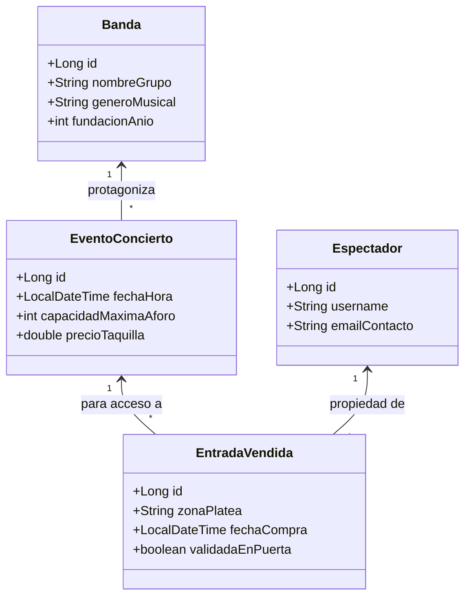

# 🎤 Blueprint: Sistema Entradas "Sala Conciertos"

## 📝 1. Enunciado y Contexto
La **Sala de Conciertos Live Music** organiza diversos conciertos durante la semana con **Bandas** de rock, pop y jazz. Actualmente venden entradas en papel lo que dificulta saber los aforos permitidos de cada función. El desafío de este backend es asegurar que un evento (Concierto) no exceda el número de Entradas Vendidas según la capacidad del recinto.

## 🎯 2. Objetivos de Aprendizaje
* Enfoque en modelar dependencias de 1 nivel (Concert/Ticket) manejadas con colecciones de tamaño restringido.
* Operaciones de selección: Seleccionar conteos con `COUNT(e.id)` usando JPQL.
* Modelado 1:N directo (Cliente y Entrada `ManyToOne`).

## 🛠️ 3. Stack Tecnológico
* **Lenguaje:** Java 21+
* **Gestor de Dependencias:** Maven
* **Framework ORM:** Hibernate Core 6.x / JPA
* **Base de Datos:** PostgreSQL 16+
* **Control de Versiones:** Git + GitHub CLI (`gh`)

## 🏗️ 4. UML y Arquitectura de Datos (Mermaid)

## 🚀 5. Blueprint: Guía de Implementación Paso a Paso

**Fase 1: Preparación del Repositorio**
1. Lanzar `gh repo create sala-conciertos --public --source=. --remote=origin --push`.
2. Añadir `hibernate-core` y `postgresql` en `pom.xml`.

**Fase 2: Relaciones JPA (`ManyToOne` Directo)**
1. Mapear `Banda`, `Espectador`, `EventoConcierto`.
2. La entidad central operativa es `EntradaVendida`, con `@ManyToOne` hacia `EventoConcierto` y a `Espectador`. Toda entrada debe estar vinculada a un único usuario físico y un único evento musical.

**Fase 3: CRUD Transaccional Poniendo a Prueba la Lógica**
1. Insertar la Banda("Metallica", "Trash Metal").
2. Insertar un Evento (Concierto para el próximo viernes a las 22:00, 50 EUR).
3. Insertar a "Juan" como Espectador y validarlo.
4. Generar venta: Relacionar a Juan con el concierto simulando una compra `Persist(Entrada)`.
5. Git Push - "Venta de Entradas Sala Conciertos".
