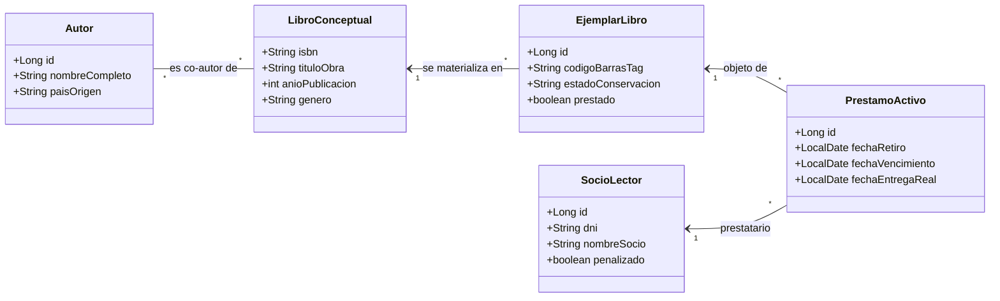

# 📚 Blueprint: Biblioteca "Mariano Literatura"

## 📝 1. Enunciado y Contexto
La **Biblioteca Municipal Mariano** tiene cientos de libros clasificados por temática, pero al momento de prestar volúmenes a los socios lo anotan a bolígrafo. Necesitan digitalizar todo el fondo documental de **Obras Literarias**, el directorio de **Autores**, y llevar el control estricto de **Préstamos** hechos a un conjunto de **Socios Lector** registrados, alertando y guardando penalizaciones por demoras.

## 🎯 2. Objetivos de Aprendizaje
* Encontrar relaciones Compuestas (Un Libro puede tener varios Autores, un Autor varios Libros: `M:N` con `@ManyToMany`).
* Entender la diferencia lógica entre `Libro` conceptual, y `CopiaFisicaDeLibro` unificada como Ejemplar a prestar.
* Restricciones temporales: Cálculo entre `fechaPrestamo` y `fechaDevolucion` en los métodos de getters y setters custom.

## 🛠️ 3. Stack Tecnológico
* **Lenguaje:** Java 21+
* **Gestor de Dependencias:** Maven
* **Framework ORM:** Hibernate Core 6.x / JPA
* **Base de Datos:** PostgreSQL 16+
* **Control de Versiones:** Git + GitHub CLI (`gh`)

## 🏗️ 4. UML y Arquitectura de Datos (Mermaid)

## 🚀 5. Blueprint: Guía de Implementación Paso a Paso

**Fase 1: Repositorio e Inicialización**
1. Generar la estructura de Maven y `pom.xml`.
2. Lanzar: `gh repo create biblioteca-mariano --public --source=. --remote=origin --push`.

**Fase 2: Entity Mapping Enum + ManyToMany**
1. Crear el `LibroConceptual` y el `Autor` con una relación `@ManyToMany` usando tabla intermedia (`libro_autor`).
2. Crear clase `EjemplarLibro` marcando con un `@ManyToOne` refiriéndose a su obra madre (`LibroConceptual`). La biblioteca solo presta ejemplares físicos, no conceptos textuales.
3. La entidad transaccional `PrestamoActivo` debe vincular a `@ManyToOne` un Socio, y un Ejemplar específico (Que quedará con estado `prestado=true`).

**Fase 3: Ejecución de Caso Práctico**
1. Insertar Libro ("Quijote", "Novela"), y al Autor ("Cervantes", "España"). Guardarlos con la colección acoplada.
2. Insertar dos Ejemplares idénticos que hereden/referencian al mismo libro conceptual ("Estado bueno").
3. Registrar un SocioLector ("Luis García").
4. Generar el Préstamo vinculando "Luis" con el "Ejemplar ID 1". El campo prestado de Ejemplar debe pasar a `true`.
5. Hacer `update()/persist()`. Confirmar subida completa al GitHub maestro.
