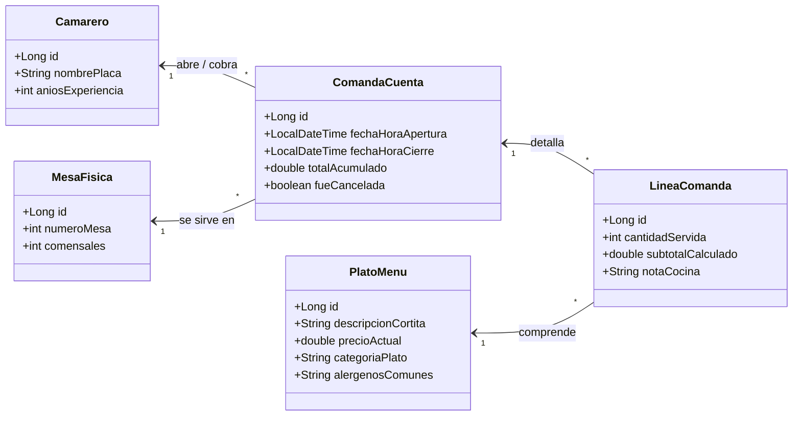

# 🍽️ Blueprint: Restaurante Alta Cocina "Comandas Exprés"

## 📝 1. Enunciado y Contexto
Un **Restaurante de Alta Cocina** llamado "Restauración Fina", que cuenta con múltiples Salones, requiere digitalizar la toma de comandas de sus Camareros. La cuenta final para los Clientes debe poder agrupar varios Platos y Bebidas con cantidades diferentes, que provienen de una Carta o Menú estandarizado. Al cerrar la mesa, la Comanda se factura y almacena.

## 🎯 2. Objetivos de Aprendizaje
* Enfoque en modelar Detalle de Factura usando `@ElementCollection` de objetos u `@OneToMany` usando objetos tipo `LineaComanda`.
* Emplear cálculo acumulativo para el `Gran Total` desde objetos hijos hacia el padre (Comanda).
* Consultas simples Hibernate: Sumatorio de ganancias mensuales mediante Criteria API o JPQL.

## 🛠️ 3. Stack Tecnológico
* **Lenguaje:** Java 21+
* **Gestor de Dependencias:** Maven
* **Framework ORM:** Hibernate Core 6.x / JPA
* **Base de Datos:** PostgreSQL 16+
* **Control de Versiones:** Git + GitHub CLI (`gh`)

## 🏗️ 4. UML y Arquitectura de Datos (Mermaid)

## 🚀 5. Blueprint: Guía de Implementación Paso a Paso

**Fase 1: Repositorio e Inicialización**
1. Generar la estructura de Maven y `pom.xml`.
2. Lanzar: `gh repo create restauracion-alta-cocina --public --source=. --remote=origin --push`.

**Fase 2: Entity Mapping Enum + Colección M:N**
1. Crear el `Camarero` y `MesaFisica`.
2. Crear clase `PlatoMenu` anotada indicando una categoría (Carnes, Pescados, Postres).
3. Añadir entidad central `ComandaCuenta`. Relacionarla `@ManyToOne` con `Camarero` dependiente, y `Mesa` en donde sirven. Emplear un `@OneToMany(cascade = CascadeType.ALL, mappedBy = "padreCuenta")` que abrace una List<LineaComanda>.
4. En clase `LineaComanda` crear variables ManyToOne a la `ComandaCuenta` (padreCuenta) y ManyToOne hacia `PlatoMenu` (para sacar precio de lista).

**Fase 3: Ejecución de Caso Práctico**
1. Registrar al Plato ("Solomillo a la Pimienta", 35.00), ("Copa Vino Tinto", 8.00). Guardarlo acoplado.
2. Empezar a generar una Factura ("Comanda de Mesa 1") atendida por "Camarero Luis".
3. Llenar líneas añadiendo (2 Solomillos, y 2 Copas de Vino), multiplicando precios automáticamente en Entidades.
4. Acabar transaccionalmente (Save Comanda -> Generará 2 Updates Lines por cascada).
5. Fin del día: `git add .` y subir todo a main "Alta cocina cerrado".
