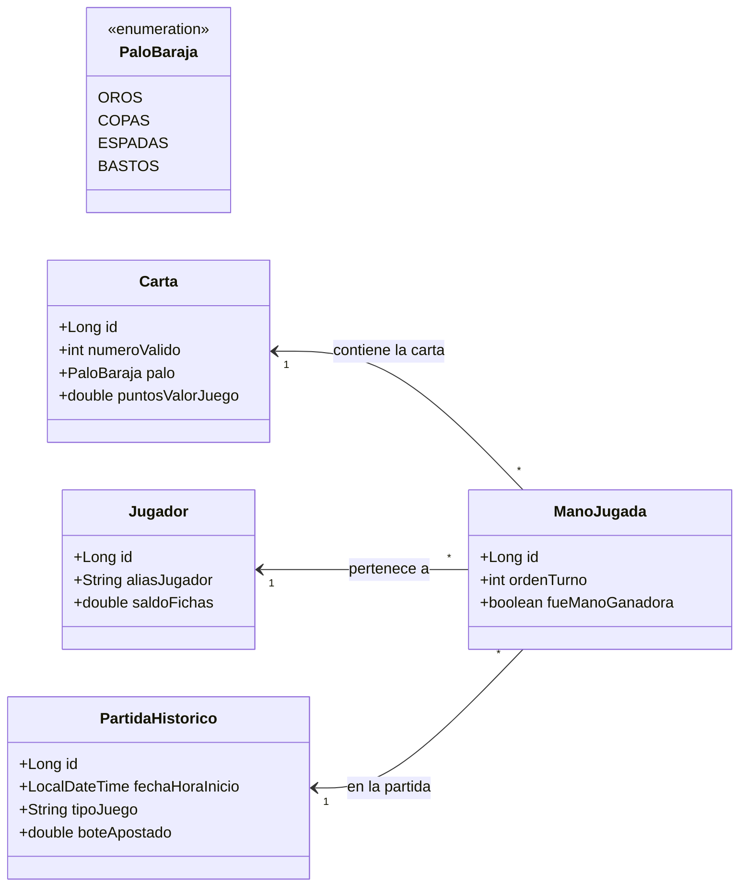

# 🃏 Blueprint: Juego de Cartas "Baraja Española"

## 📝 1. Enunciado y Contexto
Un casino en línea quiere digitalizar los clásicos juegos de cartas españoles (como el Mus, el Truco o la Brisca). Necesitan un sistema que persista las **Cartas** de la baraja tradicional, los **Jugadores** registrados que se sientan a apostar, y el registro histórico de las **Partidas** jugadas, junto con las cartas que conformaron la mano (baza) ganadora de cada jugador.

## 🎯 2. Objetivos de Aprendizaje
* Modelar Enumerados clave (`@Enumerated(EnumType.STRING)`) para los "Palos" de la baraja (Oros, Copas, Espadas, Bastos).
* Configurar Entidades inmutables o estáticas (las 40 cartas de la baraja).
* Manejar listas de elementos atados a una entidad superior (La mano de un jugador en una partida).

## 🛠️ 3. Stack Tecnológico
* **Lenguaje:** Java 21+
* **Gestor de Dependencias:** Maven
* **Framework ORM:** Hibernate Core 6.x / JPA
* **Base de Datos:** PostgreSQL 16+
* **Control de Versiones:** Git + GitHub CLI (`gh`)

## 🏗️ 4. UML y Arquitectura de Datos (Mermaid)

## 🚀 5. Blueprint: Guía de Implementación Paso a Paso

**Fase 1: Repositorio e Inicialización**
1. Generar la estructura de Maven y `pom.xml`.
2. Lanzar: `gh repo create baraja-espanola --public --source=. --remote=origin --push`.

**Fase 2: Entity Mapping y Enumerados**
1. Crear el `enum PaloBaraja` (OROS, COPAS, BASTOS, ESPADAS).
2. Crear la entidad `Carta`, que debe tener `@Enumerated(EnumType.STRING)` para persistir el Palo.
3. Crear `PartidaHistorico` y `Jugador`.
4. El mapeo cruzado fuerte es en `ManoJugada`: Tiene tres `@ManyToOne` (hacia Carta, Jugador y Partida). Esta tabla asocia que "la carta 12 de Oros" la tenía "Juan" en la "Partida XYZ".

**Fase 3: Ejecución de Caso Práctico**
1. Inicializar Catálogo de Base de Datos guardando en bucle las 40 cartas estáticas (números 1 al 12, omitiendo quizá los 8 y 9 si jugamos Mus).
2. Insertar a dos Jugadores ("Musero_4" y "PacoBrisca").
3. Crear y Persistir un objeto `PartidaHistorico` (Partida de Mus, bote 50 Fichas).
4. Asignarle 4 cartas a "Musero_4" vinculándolas a través de 4 objetos `ManoJugada`. Comitear a BBDD y hacer push en git.
