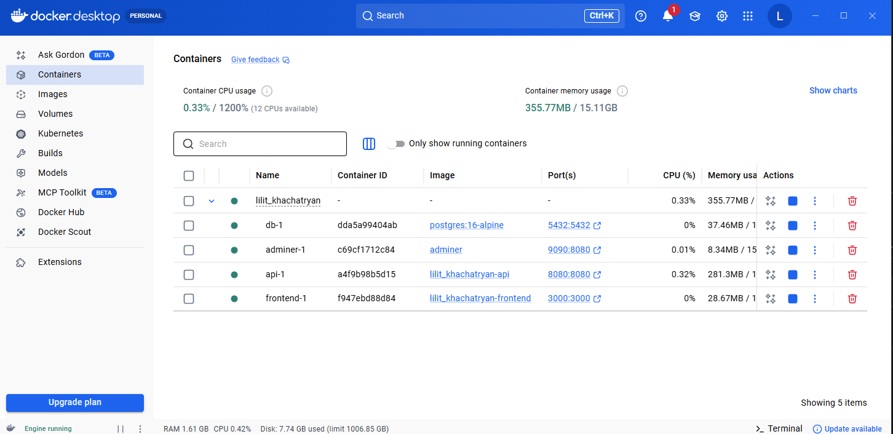
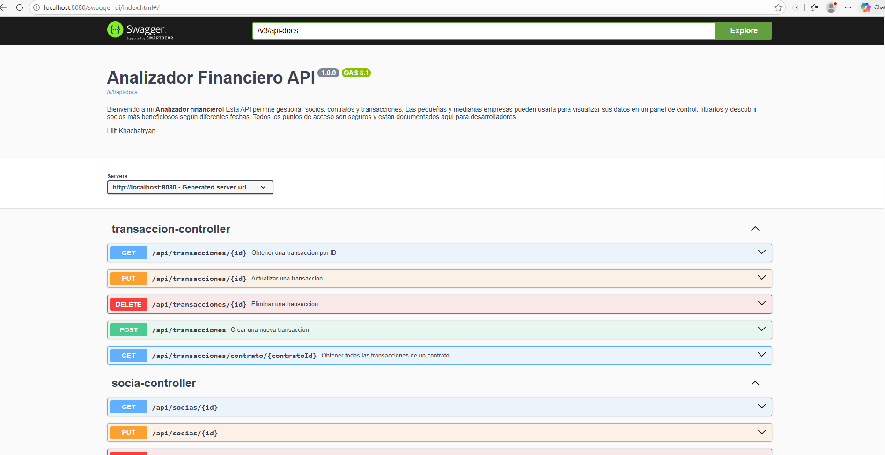
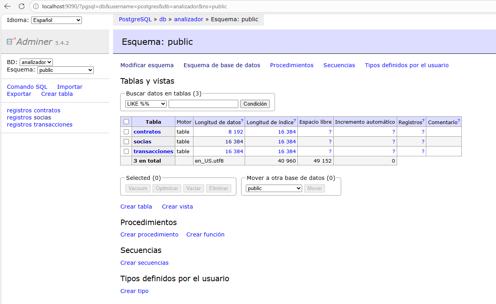

# Infraestructura Docker — Bloque A‌‌‌​‌​‌‌​‍‍​‍​​​​‍‌‌‍​‌‌‍‌‍​​‍​​‍‌‍​‌​‌‌‌‍​​‍‌​​‍​‌‍‌‍​​‌‌‍​‍

## docker-compose.yml

```yaml
services:
  # =====================================================
  # Servicio 1: Frontend React
  # =====================================================
  frontend:
    build: frontend
    ports:
      - "3000:3000"
    environment:
      - REACT_APP_API_URL=http://api:8080/api
    depends_on:
      - api
    restart: on-failure

  # =====================================================
  # Servicio 2: La aplicacion Spring Boot
  # =====================================================
  api:
    build: .
    ports:
      - "8080:8080"
    environment:
      - SERVER_PORT=8080
      - SPRING_DATASOURCE_URL=jdbc:postgresql://db:5432/analizador
      - SPRING_DATASOURCE_USERNAME=postgres
      - SPRING_DATASOURCE_PASSWORD=secret
      - SPRING_DATASOURCE_DRIVER_CLASS_NAME=org.postgresql.Driver
      - SPRING_JPA_DATABASE_PLATFORM=org.hibernate.dialect.PostgreSQLDialect
      - SPRING_SQL_INIT_MODE=always
      - SPRING_JPA_DEFER_DATASOURCE_INITIALIZATION=true
      - SPRING_JPA_HIBERNATE_DDL_AUTO=create
      - SPRING_H2_CONSOLE_ENABLED=false
    depends_on:
      db:
        condition: service_healthy
    restart: on-failure

  # =====================================================
  # Servicio 3: Base de datos PostgreSQL
  # =====================================================
  db:
    image: postgres:16-alpine
    environment:
      - POSTGRES_DB=analizador
      - POSTGRES_USER=postgres
      - POSTGRES_PASSWORD=secret
    ports:
      - "5432:5432"
    volumes:
      - postgres_data:/var/lib/postgresql/data
    healthcheck:
      test: ["CMD-SHELL", "pg_isready -U postgres"]
      interval: 5s
      timeout: 5s
      retries: 5

  # =====================================================
  # Servicio 4: Adminer (panel web para ver la BD)
  # =====================================================
  adminer:
    image: adminer
    ports:
      - "9090:8080"
    depends_on:
      db:
        condition: service_healthy

# =======================================================
# Volumenes (para que los datos persistan)
# =======================================================
volumes:
  postgres_data:
```
  
### Explicacion de cada seccion

**services:**
Esta seccion define todos los contenedores que forman parte de la aplicacion. 
En este proyecto hay cuatro servicios: frontend, api, db y adminer.

**frontend:**
Este servicio levanta la aplicacion cliente hecha en React.
- `build`: frontend Indica que Docker debe construir la imagen usando el Dockerfile que esta dentro de la carpeta frontend.
- `ports`: Expone el puerto 3000 del contenedor al puerto 3000 de la maquina local. Asi se puede abrir la aplicacion desde el navegador en http://localhost:3000.
- `environment`: Define variables de entorno dentro del contenedor. REACT_APP_API_URL=http://api:8080/api le dice al frontend que la API backend esta disponible en el servicio api dentro de la red interna de Docker.
- `depends_on`: Indica que el frontend depende del servicio api, por lo que Docker intentara arrancar antes el backend.
- `restart`: on-failure Si el contenedor falla, Docker intentara reiniciarlo automaticamente.

**api:**
Este servicio levanta la aplicacion backend hecha con Spring Boot.
- `build`: . Docker construye la imagen usando el Dockerfile del directorio raiz del proyecto.
- `ports`: Expone el puerto 8080 del contenedor al puerto 8080 local. Asi la API queda accesible en http://localhost:8080.
- `environment`: Configura variables de entorno para Spring Boot:
   - `SERVER_PORT`=8080: define el puerto interno de la aplicacion.
   - `SPRING_DATASOURCE_URL`=jdbc:postgresql://db:5432/analizador: indica la URL de conexion a PostgreSQL.
   - `SPRING_DATASOURCE_USERNAME`=postgres: usuario de la base de datos.
   - `SPRING_DATASOURCE_PASSWORD`=secret: contrasena de la base de datos.
   - `SPRING_DATASOURCE_DRIVER_CLASS_NAME`=org.postgresql.Driver: driver JDBC de PostgreSQL.
   - `SPRING_JPA_DATABASE_PLATFORM`=org.hibernate.dialect.PostgreSQLDialect: dialecto de Hibernate para PostgreSQL.
   - `SPRING_SQL_INIT_MODE`=always: ejecuta scripts SQL de inicializacion siempre que arranca.
   - `SPRING_JPA_DEFER_DATASOURCE_INITIALIZATION`=true: hace que la inicializacion de datos ocurra despues de crear el esquema.
   - `SPRING_JPA_HIBERNATE_DDL_AUTO`=create: crea las tablas automaticamente al iniciar.
   - `SPRING_H2_CONSOLE_ENABLED`=false: desactiva la consola H2 porque en Docker se usa PostgreSQL.

- `depends_on`: Indica que la API depende de db. condition: service_healthy significa que no solo espera a que el contenedor exista, sino a que la base de datos este sana y lista para aceptar conexiones.
- `restart`: on-failure Reinicia el backend automaticamente si falla.

**db:**
Este servicio levanta la base de datos PostgreSQL.

- `image`: postgres:16-alpine Usa una imagen oficial de PostgreSQL version 16 basada en Alpine, que es ligera.
- `environment`: Configura la base de datos al arrancar:
   - `POSTGRES_DB`=analizador: nombre de la base de datos.
   - `POSTGRES_USER`=postgres: usuario.
   - `POSTGRES_PASSWORD`=secret: contrasena.
- `ports`: Expone el puerto 5432 de PostgreSQL al mismo puerto en la maquina local. Asi se puede conectar desde herramientas externas si hace falta.
- `volumes`: Monta el volumen postgres_data en /var/lib/postgresql/data para que los datos no se pierdan al detener o recrear el contenedor.
- `healthcheck`: Define una comprobacion de salud del servicio:
    - `test`: ejecuta `pg_isready -U postgres` para verificar si PostgreSQL esta listo.
    - `interval: 5s`: revisa cada 5 segundos.
    - `timeout: 5s`: espera hasta 5 segundos por cada comprobacion.
    - `retries: 5`: intenta 5 veces antes de marcarlo como no saludable.

**adminer:**
Este servicio levanta Adminer, una herramienta web para gestionar la base de datos.
- `image`: adminer Usa la imagen oficial de Adminer.
- `ports`: Expone Adminer en http://localhost:9090.
- `depends_on`: Hace que Adminer dependa de db y espere a que la base de datos este lista antes de arrancar.

**volumes:**
Esta seccion define los volumenes persistentes usados por los contenedores.
- `postgres_data`: Crea un volumen llamado postgres_data para guardar de forma persistente los datos de PostgreSQL.

## Dockerfile
[Copia tu Dockerfile y explica cada instruccion]
```yaml
# ============================================================
# Etapa 1: Compilar con Maven (como hacer mvn package)
# ============================================================
FROM maven:3.9-eclipse-temurin-17 AS builder
WORKDIR /app
COPY pom.xml .
COPY src ./src
RUN mvn clean package -DskipTests

# ============================================================
# Etapa 2: Ejecutar con JRE ligero (solo lo necesario)
# ============================================================
FROM eclipse-temurin:17-jre-alpine
WORKDIR /app
COPY --from=builder /app/target/*.jar app.jar
EXPOSE 8080
ENTRYPOINT ["java", "-jar", "app.jar"]
```

## Explicacion de cada instruccion

- `FROM maven:3.9-eclipse-temurin-17 AS builder`: usa una imagen base que ya incluye Maven y Java 17. Esta etapa se utiliza para compilar el proyecto y generar el archivo ejecutable `.jar`.
- `WORKDIR /app`: establece el directorio de trabajo dentro del contenedor. A partir de este momento, las siguientes instrucciones se ejecutaran dentro de la carpeta `/app`.
- `COPY pom.xml .`: copia el archivo `pom.xml` al contenedor. Este archivo contiene la configuracion del proyecto Maven y sus dependencias.
- `COPY src ./src`: copia el codigo fuente de la aplicacion al contenedor, incluyendo clases Java y recursos necesarios para la compilacion.
- `RUN mvn clean package -DskipTests`: ejecuta Maven para limpiar compilaciones anteriores y generar el archivo `.jar` del proyecto. La opcion `-DskipTests` evita ejecutar los tests durante el build.
- `FROM eclipse-temurin:17-jre-alpine`: inicia una segunda etapa mas ligera, usando solo el entorno necesario para ejecutar Java. Esto permite que la imagen final ocupe menos espacio.
- `WORKDIR /app`: vuelve a definir `/app` como directorio de trabajo en la etapa final donde se ejecutara la aplicacion.
- `COPY --from=builder /app/target/*.jar app.jar`: copia el archivo `.jar` generado en la etapa de compilacion (`builder`) a la imagen final y lo renombra como `app.jar`.
- `EXPOSE 8080`: indica que el contenedor utiliza el puerto `8080` para ejecutar la aplicacion. Debe coincidir con la configuracion del proyecto y con el puerto expuesto en `docker-compose.yml`.
- `ENTRYPOINT ["java", "-jar", "app.jar"]`: d
 

## Evidencia

Capturas incluidas:

- `docker ps` mostrando los contenedores `frontend`, `api`, `db` y `adminer` en ejecucion.
- Swagger o navegador mostrando una respuesta correcta de un endpoint como `GET /api/socias`.
- Adminer mostrando la base de datos `analizador` y las tablas `socias`, `contratos` y `transacciones`.
- Aplicacion frontend abierta en `http://localhost:3000` 

### Contenedores corriendo



### API respondiendo



### Adminer mostrando tablas

