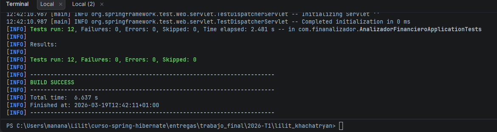
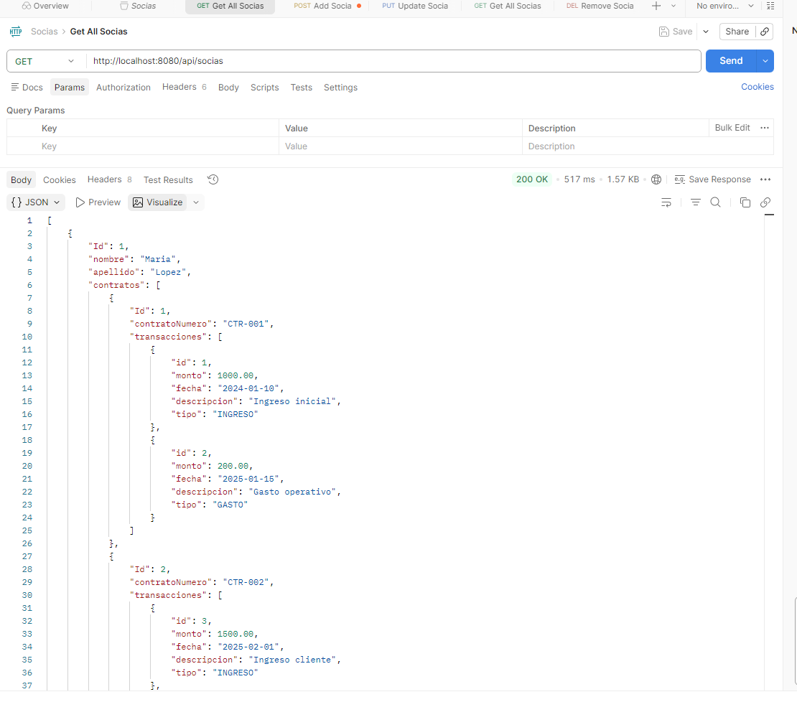

# Resultados — Bloque C‌‌‌​‌​‌‌​‍‍​‍‌​​​​​​​‌‍​‌​​​‍​​‌​​‌‌​‌‍​‌‍​​‍​‌​‌‌‌‍‌‌‌‍​‍

## Opcion elegida
[Validacion / Testing]

## Que implementaron
Se implemento una bateria de tests principales para validar el comportamiento de los endpoints mas importantes de la API. 
En concreto, se añadieron pruebas sobre los controladores de `socias`, `contratos` y `transacciones` usando `MockMvc` y servicios simulados con Mockito.
Los tests cubren casos de exito y casos de error, especialmente respuestas `404 Not Found` cuando un recurso no existe y respuestas correctas 
en operaciones de consulta, creacion, calculo de beneficio y eliminacion.

En total, se implementaron 12 tests automatizados sobre los endpoints principales.


## Evidencia
Se ejecutó la suite de tests con Maven usando el comando:

```bash
mvn -Dtest=AnalizadorFinancieroApplicationTests test
```
## Resultado obtenido:
`Tests run`: 12, `Failures`: 0, `Errors`: 0, `Skipped`: 0
`BUILD SUCCESS`




Esta salida demuestra que los endpoints probados responden como se esperaba en los escenarios definidos.



## Codigo relevante

El archivo principal de pruebas es:

```bash
src/test/java/com/finanalizador/AnalizadorFinancieroApplicationTests.java
```

### Partes clave de la implementacion:
- Se uso MockMvc para simular peticiones HTTP a los endpoints sin necesidad de levantar toda la aplicacion.
- Se usaron mocks de SociaService, ContratoService y TransaccionService para aislar la logica del controlador.
- Se verificaron respuestas HTTP como 200 OK, 201 Created, 204 No Content y 404 Not Found.
- Se añadieron tests especificos para comprobar el manejo de ResourceNotFoundException en distintos recursos.

### Ejemplos de casos cubiertos:
- GET /api/socias devuelve la lista de socias correctamente.
- GET /api/socias/{id} devuelve 404 si la socia no existe.
- GET /api/contratos/{id} devuelve 404 si el contrato no existe.
- GET /api/transacciones/{id} devuelve 404 si la transacción no existe.
- GET /api/socias/{id}/beneficio devuelve el beneficio calculado.
- GET /api/socias/dashboard/summary devuelve el resumen del dashboard.
- DELETE /api/socias/{id} devuelve 204 al eliminar correctamente.